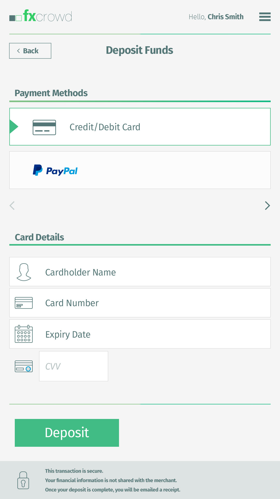

# Fxcrowd 

The purpose of this project just shows you my professions skills, knowledge to work with this kind of stuff.
Project goal of the app is to help you to make a deposit/withdrawal fastly with many PM providers in on single place.

**Note:**
 
All working flows and data are fake in the app and it won't be sending or store nothing to third party services.
Don't pass real data to the app because there's no make sense!




# Getting started
As you already you know the app is build with [React Native](https://facebook.github.io/react-native/) framework and if you want to run it in your
computer or device you have to setup envilopment in your machine. There are several ways for 
difference platforms. Follow these [instructions.](https://facebook.github.io/react-native/docs/getting-started)
## Requirements
* [Node](https://nodejs.org/en/) `^10.16.3`
* [Yarn](https://yarnpkg.com) `^1.17.3`
* [React Native](https://facebook.github.io/react-native/) `^0.60`


## Installation

**Step 1):**  After confirming that your environment meets the above [getting started](#requirements) and [requirements](#requirements), you can clone the project by doing
 the following:

```bash
$ git clone https://github.com/DeanHristov/fxcrowd.git <my-project-name>
$ cd <my-project-name>
``` 
**Step 2):** Install the all dependencies
 ```bash
 $ yarn install
 ``` 

**Step 3):** When you made the previous a couple of steps you have to run the 
script below to install native directories (android/ios) and link all dependencies automatically. 

 ```bash
 $ yarn run:eject
 ``` 
# Launching the project
 To launch the app you have to run a couple of commands separately
 
Firstly, run the [Metro bundler](https://facebook.github.io/metro/)
 ```bash
 $ yarn start:clean or yarn start
 ``` 
Secondly, run the app in your android emulator

 ```bash
 $ yarn run:android
 ```

# Project structure
The project structure is nothing special or hard to understand. 
The all my project logic is stored in **~/app** directory.
```
~/app/             Sub folder in the project
   |- assets/      All assets (fonts, icons and images) are stored here 
   |- components/  Here is stored all components which can be shared somewhere else in the APP
     |-containers  Shared containers like "modal" and etc.
     |-ui          Shared UI components 
   |- i18n/        All locales are stored here
     |- en.json
     |- bg.json
   |- modules/     There are pieces that have no corresponding view part, but they can be being reused  (utility functions and etc.)     
   |- core/        There are pieces which are responsible for initial app state,auth functionality, HOC, HOF
   |- navigation/  All kind of navigation flows are stored here
   |- screen/      The all difference screens will be stored in this folder
   |- store/       Redux store live here
   |- styles/      Common styles
     |-colors.js   Theme based colors
     |-common.js   Common used styles in many components (like Flex layout)
   |- __tests__/       Tests live here
   
```

# Main tasks

All tasks automation are based on [NPM scripts](https://docs.npmjs.com/misc/scripts).

Tasks              | Description
------------------ |---------------------------------------------------------------------------------------
yarn app:eject     | Install **~/android** and **~/ios** directories together, and after that it going to link the all dependencies
yarn start         | Starting the [Metro bundler](https://facebook.github.io/metro/)
yarn start:clean   | Starting the [Metro bundler](https://facebook.github.io/metro/) and clear the cache.
yarn start:android | Run the app in Android platform
yarn android:ports | This command will reverse adb ports and give you ability to run it real device. See this [article](https://facebook.github.io/react-native/docs/running-on-device) 
yarn test:watch    | Watch files for changes and rerun tests related to changed files
yarn test:watch:all| Watch files for changes and rerun all tests when something changes.
yarn start:ios     | Run the app in IOS platform 
=
 
-------------
#### Made by [D. Hristov](http://www.dhristov.eu) 

The project cannot be used for commercial purpose or whatever else without the author's contact

